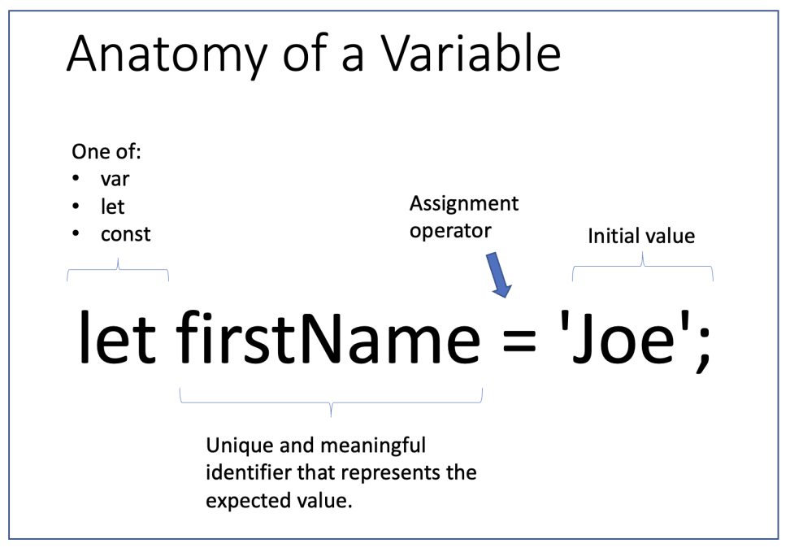

# Section 2 - Comments, Variables, Types, and I/O
## Learning Outcomes 
This section includes an overview of the fundamental building blocks in JavaScript applications.
- **Comments** - single and multiline comments
- **Variables** - hold values in applications
- **Data Types** - two basic data types and what "weakly typed" means
- **Basic input/output** - overview of some techniques for input and output

## Resources

1. Comments - <https://www.w3schools.com/js/js_comments.asp>
2. Variables - <https://www.w3schools.com/js/js_variables.asp>
3. Data Types - <https://www.w3schools.com/js/js_datatypes.asp> 
4. Input - <https://www.w3schools.com/jsref/met_win_prompt.asp> 
5. Output - <https://www.w3schools.com/js/js_output.asp>

## 1. Comments

### Single Line Comments

Single line comments start with `//`. Any text between `//` and the end of the line will 
be ignored by JavaScript (will not be executed).
  
```
let x = 5;      // Declare x, give it the value of 5
let y = x + 2;  // Declare y, give it the value of x + 2
```

### Multi-line Comments

Multi-line comments start with `/*` and end with `*/`. Any text between `/*` and `*/` will 
be ignored by JavaScript.

 ```
/*
   The code below will change
   the heading with id = "myH"
   and the paragraph with id = "myP"
   in my web page:
*/
document.getElementById("myH").innerHTML = "My First Page";
document.getElementById("myP").innerHTML = "My first paragraph.";
 ```

## 2. Variables

### What are Variables?

Variables are containers for storing data values. In this example, 
x, y, and z, are variables, declared with the let keyword:
              
```
var x = 5;
var y = 6;
var z = x + y;
```

- x stores the value 5
- y stores the value 6
- z stores the value 11

### Variables include 4 parts:

1. **Declaration** keyword (`var`, `let`, or `const`)
2. **Identifier** (variable name) - a unique name to refer to the variable
3. **Assignment operator** (`=`)
4. **Initial value** (optional but recommended)

### Keywords 

- `var` - used in older browsers. Valid, but should avoid use.
- `let` - used in modern browsers to declare variables whose value can change. Use
- `const` - used with arrays or when the value held should not change.

### Variable Names

The general rules for constructing names for variables (unique identifiers) are:

- Names can contain letters, digits, underscores, and dollar signs.
- Names must begin with a letter
- Names can also begin with $ and _ (but we will not use it in this tutorial)
- Names are case-sensitive (y and Y are different variables)
- Reserved words (like JavaScript keywords) cannot be used as names

### The Assignment Operator

In JavaScript, the equal sign (`=`) is an "assignment" operator, not an "equal to" operator.
                       


## 3. Data Types

A JavaScript variable can hold numbers like 100 and text values like "John Doe". 
In programming, text values are called text strings.

JavaScript handles two basic data types: 

- **Strings** are written inside double or single quotes. 
- **Numbers** are written without quotes.

If you put a number in quotes, it will be treated as a text string.

***JavaScript is "Weakly Typed" or "Untyped" Language - What does that mean?*** 

The data type is not explicitly included when declaring variables. The type is 
inferred based on the value the variable holds:

- If the value is declared inside quotes it is treated as a string. 
- If the value is a number it is treated as a number. 

JavaScript will "try" figure out what type of data you have and make the necessary 
adjustments so that you don't have to redefine your different types of data.

**CAUTION**: This means that the same variable can be used to hold different data 
types:

```
let x;           // Now x is undefined
x = 5;           // Now x is a Number
x = "John";      // Now x is a String
```

## 4. Input (Prompt)

The `prompt()` method displays a dialog box that prompts the user for input.
The `prompt()` method returns the input value if the user clicks "OK", otherwise it returns null.
                                     
### Syntax

```
prompt(text, defaultText)
```

#### Parameters

| Parameter     | Description                                      |
|---------------|--------------------------------------------------|
| *text*        | `Required`. The text to display in the dialog box. |
| *defaultText* | `Optional`. The default input text.                |

#### Return Value
                
| Syntax | Description                                                                       |
| ----------- |-----------------------------------------------------------------------------------|
| A string | If the user clicks "OK", the input value is returned. Otherwise `null` is returned. |
                   
Note values from `prompt()` are Strings.

```
let person = prompt("Please enter your name", "Harry Potter");

if (person != null) {
  document.getElementById("demo").innerHTML =
  "Hello " + person + "! How are you today?";
}
```

## 5. Output 

JavaScript can "display" data in different ways:

- Writing into an HTML element, using `document.elementById(id).innerHTML`.
- Writing into the HTML output using `document.write()`.
- Writing into an alert box, using `window.alert()`.
- Writing into the browser console, using `console.log()`.

### document.elementById(id).innerHTML

To access an HTML element, JavaScript can use the `document.getElementById(id)` method.
The `id` attribute defines the HTML element. The `innerHTML` property defines the HTML 
content:
                    
```
<!DOCTYPE html>
<html>
  <body>
    <h1>My First Web Page</h1>
    <p>My First Paragraph</p>
    
    <p id="demo"></p>
    
    <script>
      document.getElementById("demo").innerHTML = 5 + 6;
    </script>
    
  </body>
</html>
```

### document.write()

For testing purposes, it is convenient to use `document.write()`:

```
<!DOCTYPE html>
<html>
  <body>

    <h1>My First Web Page</h1>
    <p>My first paragraph.</p>

    <script>
      document.write(5 + 6);
    </script>

  </body>
</html>
```

### window.alert()

You can use an `alert` box to display data:

```
<!DOCTYPE html>
<html>
  <body>

   <h1>My First Web Page</h1>
   <p>My first paragraph.</p>

   <script>
     window.alert(5 + 6);
   </script>

  </body>
</html>
```

### console.log()

For debugging purposes, you can call the `console.log()` method in the browser to 
display data.
               
```
<!DOCTYPE html>
<html>
  <body>

  <script>
    console.log(5 + 6);
  </script>

  </body>
</html>
```

### Strings and the + operator

The `+` operator can also be used to concatenate strings.
           
```
let text1 = "John";
let text2 = "Doe";
let text3 = text1 + " " + text2;
```

Output:

```
John Doe
```


