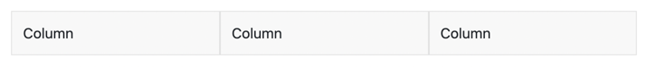
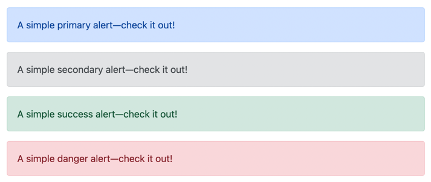
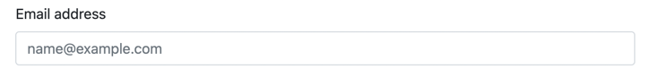

# Section 7 - CSS, Forms, and DOM Events

## Overview

This section covers CSS and a popular CSS Framework, Bootstrap. We will cover the grid layout system, alerts, forms, and form validation. 
There will also be a review of JavaScript events and several examples of functions will be covered. 

## Content Links

- CSS Intro - <https://www.w3schools.com/css/default.asp>
- Bootstrap: <https://getbootstrap.com/docs/5.0/getting-started/introduction/>
    - Grid System - <https://getbootstrap.com/docs/5.0/layout/grid/>
    - Alerts - <https://getbootstrap.com/docs/5.0/components/alerts/>
    - Forms - <https://getbootstrap.com/docs/5.0/forms/overview/>
- DOM Events
    - <https://www.w3schools.com/js/js_events.asp>
    - <https://www.w3schools.com/js/js_htmldom_events.asp>

## CSS Introduction
                 
### CSS Intro 

CSS stands for Cascading Style Sheets. It is the language for describing the presentation of Web pages, including colors, layout, and fonts, thus making our web pages presentable to the users.

#### What does "cascade" mean in CSS? 

The cascade is an algorithm that defines how to combine property values originating from different sources. It lies at the core of CSS, as emphasized by the name: Cascading Style Sheets.

Simply put CSS defines the rules related to how styles are applied in a web page when there are multiple sources and matching patterns.

> The majority of topics related to CSS are out of scope for this class as we are focused on dynamic aspects of web pages with JavaScript. 

More Info: <https://developer.mozilla.org/en-US/docs/Web/CSS/Cascade>


## Bootstrap CSS

Get started with Bootstrap, the world's most popular framework for building responsive, mobile-first sites, and a template starter page.

### Add to Pages via CDN

Copy-paste the stylesheet `<link>` into your `<head>` before all other stylesheets to load our CSS.

```
<linkhref="https://cdn.jsdelivr.net/npm/bootstrap@5.0.2/dist/css/bootstrap.min.css"rel="stylesheet"integrity="sha384-EVSTQN3/azprG1Anm3QDgpJLIm9Nao0Yz1ztcQTwFspd3yD65VohhpuuCOmLASjC"crossorigin="anonymous">
```

### Basic Page Template

Below is a basic html page that includes Bootstrap via CDN link.
      
```
<!doctype html>
<html lang="en">
<head>
<!-- Required meta tags -->
<meta charset="utf-8">
<meta name="viewport" content="width=device-width, initial-scale=1">

<!-- Bootstrap CSS -->
<link 
href="https://cdn.jsdelivr.net/npm/bootstrap@5.0.2/dist/css/bootstrap.min.css" 
rel="stylesheet" 
integrity="sha384-EVSTQN3/azprG1Anm3QDgpJLIm9Nao0Yz1ztcQTwFspd3yD65VohhpuuCOmLASjC" crossorigin="anonymous">

<title>Hello, world!</title>
</head>
<body>

<h1>Hello, world!</h1>

</body>
</html>
```

### Layout Grid

Bootstrap's grid system uses a series of containers, rows, and columns to layout and align content. It's built with 
flexbox and is fully responsive. Grids can be nested to build complex UIs.

```
<div class="container">
  <div class="row">
    <div class="col">
      Column
    </div>
    <div class="col">
      Column
    </div>
    <div class="col">
      Column
    </div>
  </div>
</div>
```
 
The HTML above will result in the following:



The above example creates three equal-width columns across all devices and viewports using our predefined grid classes. Those columns are centered in the page with the parent `.container`.

Using grid layout is one solution when laying out visual components on the page.

### Alerts

Provide contextual feedback messages for typical user actions with the handful of available and flexible alert messages.
    


```
<div class="alert alert-primary" role="alert">
  A simple primary alert—check it out!
</div>
<div class="alert alert-secondary" role="alert">
  A simple secondary alert—check it out!
</div>
<div class="alert alert-success" role="alert">
  A simple success alert—check it out!
</div>
<div class="alert alert-danger" role="alert">
  A simple danger alert—check it out!
</div>
```

### Forms

**PSA**: The overall goal of forms and form validation is to capture "high quality" data from users. That is important to the application designers and maintainers. Users typically want to complete the form as quickly and painlessly as possible. 

Examples and usage guidelines for form control styles, layout options, and custom components for creating a wide variety of forms.


   
```
<div class="mb-3">
<label for="exampleFormControlInput1" class="form-label">Email address</label>
<input type="email" class="form-control" id="exampleFormControlInput1" placeholder="name@example.com">
</div>
```

#### Input
 
There are many types of input controls supported:

- Text fields (single line)
- Text areas (multiple lines)
- Select/Dropdown/Pick lists
- Checkboxes
- Radio buttons
- Custom UI Input controls

#### Labels

Labels are "linked" to input controls via the id/for field. 

#### Validation

There are many validation frameworks available today. Goal is to prevent "garbage in, garbage out". All involve the following basic steps:

- Evaluating the user input against expected business rules:
  - Required input
  - Length
  - Input conforming to established data patterns
    - Phone numbers
    - Zip codes
    - Email addresses
    - Credit Card Numbers
  - Providing feedback to the user of data issues with instruction on how to correct. 


## DOM Events Introduction

DOM Revisited

- Frequent actions with DOM - find element by id and dynamically change content without reloading the page. 

### Events

An HTML event can be something the browser does, or something a user does.

Here are some examples of HTML events:

- An HTML web page has finished loading
- An HTML input field was changed
- An HTML button was clicked

Often, when events happen, you may want to do something. JavaScript lets you execute code when events are detected. HTML allows event handler attributes, with JavaScript code, to be added to HTML elements.

Here is a list of some common HTML events:

| Event | Description |
|----|----|
| `onchange` | An HTML element has been changed |
| `onclick` | The user clicks an HTML element |
| `onmouseover` | The user moves the mouse over an HTML element |
| `onmouseout` | The user moves the mouse away from an HTML element |
| `onkeydown` | The user pushes a keyboard key |
| `onload` | The browser has finished loading the page |

### JavaScript Event Handlers

Event handlers can be used to handle and verify user input, user actions, and browser actions:

- Things that should be done every time a page loads
- Things that should be done when the page is closed
- Action that should be performed when a user clicks a button
- Content that should be verified when a user inputs data
- And more ...

Many different methods can be used to let JavaScript work with events:

- HTML event attributes can execute JavaScript code directly
- HTML event attributes can call JavaScript functions
- You can assign your own event handler functions to HTML elements
- You can prevent events from being sent or being handled
- And more ...

```
<button onclick="alert('Hello')">Click me.</button>
```