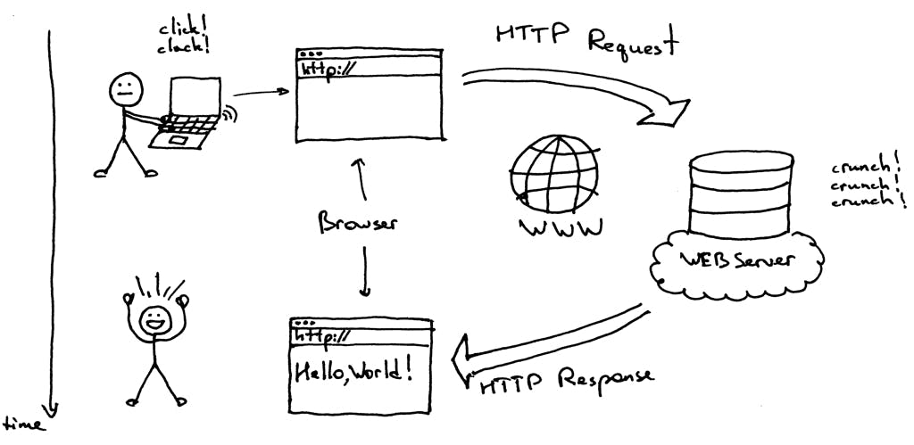
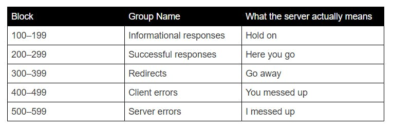

# Section 8 - Client/Server and PHP

## Overview
         
A foundation in client/server concepts is essential in designing and maintaining rich internet applications. Frequently,
the client (i.e. the browser) receives information from a "back end" server that is displayed dynamically. 

## Content Links

- Internet 101 - <https://www.internetsociety.org/internet/>
- What is a URL? <https://developer.mozilla.org/en-US/docs/Learn/Common_questions/What_is_a_URL>
- Client / Server - <https://hackernoon.com/http-made-easy-understanding-the-web-client-server-communication-yz783vg3>
- PHP Overview
    - Intro - <https://www.w3schools.com/php/default.asp>
    - Variables - <https://www.w3schools.com/php/php_variables.asp>
    - Data Types - <https://www.w3schools.com/php/php_datatypes.asp>
    - Operators - <https://www.w3schools.com/php/php_operators.asp>
    - Decisions (if/else) - <https://www.w3schools.com/php/php_if_else.asp>
    - Loops - <https://www.w3schools.com/php/php_looping.asp>
    - Arrays (index) - <https://www.w3schools.com/php/php_arrays_indexed.asp>
    - Arrays (associative) - <https://www.w3schools.com/php/php_arrays_associative.asp>
- PHP GET vs POST - <https://www.w3schools.com/tags/ref_httpmethods.asp>
- CofC Student - <http://stu.cofc.edu/index.php>
    - Set Up - <http://stu.cofc.edu/howto.php>
    - Access URL - <https://accountName.stu.cofc.edu>

## Internet 101

### What is the internet?

The global Internet consists of tens of thousands of interconnected networks run by service providers, individual companies, universities and  governments. Open standards are what enable this network of Internet networks to communicate. And they’re what make it possible for anyone to create content, offer services, and sell products without requiring permission from a central authority. ()

### What is a URL? 

URL stands for Uniform Resource Locator. A URL is nothing more than the address of a given unique resource on the Web. In theory, each valid URL points to a unique resource. Such resources can be an HTML page, a CSS document, an image, etc.

A URL is composed of different parts, some mandatory and others optional. The most important parts are highlighted on the URL below (details are provided in the following sections):


The scheme, which indicates the protocol that the browser must use to request the resource (a protocol is a set method for exchanging or transferring data around a computer network). Usually for websites the protocol is HTTPS or HTTP. FTP is another protocol to exchange files. 
  1. The authority, which is separated from the scheme by the character pattern ://. If present the authority includes both the domain (e.g. www.example.com) and the port (80), separated by a colon:
     1. The domain indicates which Web server is being requested. Usually this is a domain name, but an IP address may also be used.
     2. The port indicates the technical "gate" used to access the resources on the web server. It is usually omitted if the web server uses the standard ports of the HTTP protocol (80 for HTTP and 443 for HTTPS) to grant access to its resources. Otherwise it is mandatory.
  2. The path to the file (/path/to/myfile.html) is the path to the resource on the Web server. In the early days of the Web, a path like this represented a physical file location on the Web server. Nowadays, it is mostly an abstraction handled by Web servers without any physical reality.
  3. The parameters (?key1=value1&key2=value2) are extra parameters provided to the Web server. Those parameters are a list of key/value pairs separated with the & symbol. The Web server can use those parameters to do extra stuff before returning the resource.
  4. The anchor (#SomewhereInTheDocument) is an anchor to another part of the resource itself. An anchor represents a sort of "bookmark" inside the resource, giving the browser the directions to show the content located at that "bookmarked" spot.


### What do you do with URLs?

- Get information (GET) - one style of interacting with a URL is simply to get information that is to be used in different ways. For example, news feed of text, styles (CSS files) and links to images to be displayed in a browser. 
- Send information (PUT or POST) - another style of interacting with a URL is to add information. Back to our news example, people would key in news articles and upload photos for a new file path. In this case, information is sent, saved and then read by others.

## Client / Server Request                                          



### HTTP Methods

So a client makes a request to the server, how would the server know which operation to perform?

> "HTTP uses methods to inform the server what actions need to be performed when the client sends a request. It is also called as HTTP verbs. Each of these methods performs the operation required and returns success or failure on its completion."

### GET

GET requests are read only, they are used to read the data, retrieve it, and return that to the client. It is the simplest among all the requests since it provides the required resource without any modifications. 

### POST

POST requests are used to create or add a new item to the requested URL. For example, creating a new account or posting a new blog o medium. Based on your URL, it posts the data to a specific location. Once done, it responds with the status code 201 (CREATED), along with the location link of the posted data. 

### HTTP Status Codes

So a client makes a request to the server, how would the client know about the status of the request?

> "Status codes let us know whether the request we made to the server was a success or a failure or something in between."



- **1xx - Informational**: The server has not fully completed the request, it is still thinking and is in a transitional phase
- **2xx - Successful**: The server has successfully completed the request
- **3xx - Redirects**: This block is for redirections, it means you requested an address but you were sent somewhere else
- **4xx - Client Errors**: There is some error from your side
- **5xx - Server Errors**: There is some error on the server-side.

## PHP Intro

PHP is a server scripting language, and a powerful tool for making dynamic and interactive Web pages. PHP is a widely-used, free, and efficient alternative to competitors such as Microsoft's ASP.

### What is PHP?

- PHP is an acronym for "PHP: Hypertext Preprocessor"
- PHP is a widely-used, open source scripting language
- PHP scripts are executed on the server
- PHP is free to download and use

### What Can PHP Do?

- PHP can generate dynamic page content
- PHP can create, open, read, write, delete, and close files on the server
- PHP can collect form data
- PHP can send and receive cookies
- PHP can add, delete, modify data in your database
- PHP can be used to control user-access
- PHP can encrypt data

With PHP you are not limited to output HTML. You can output images, PDF files, and even Flash movies. You can also output any text, such as XHTML and XML.  

### Basic Syntax

A PHP script is defined with the following syntax:

```
<?php
  // PHP code goes here
?>
```
          
The default file extension for PHP files is ".php".

A PHP file normally contains HTML tags, and some PHP scripting code. Below, we have an example of a simple PHP file, with a PHP script that uses a built-in PHP function "echo" to output the text "Hello World!" on a web page:

### Variables 

In PHP, a variable starts with the `$` sign, followed by the name of the variable:

```
<?php
  $txt = "Hello world!";
  $x = 5;
  $y = 10.5;
?>
```
    
### Data Types 

PHP supports the following data types:

- String
- Integer
- Float (floating point numbers - also called double)
- Boolean
- Array
- Object
- NULL
- Resource

### Operators 

PHP divides the operators in the following groups:

- Arithmetic operators
- Assignment operators
- Comparison operators
- Increment/Decrement operators
- Logical operators
- String operators
- Array operators
- Conditional assignment operators
          
### Arithmetic Operators
The PHP arithmetic operators are used with numeric values to perform common arithmetical operations, such as addition, subtraction, multiplication etc.

| Operator | Name         | Example  | Result |
|--------|--------------|----------|----|
| `+`    | Addition     | `$x + $y`  | Sum of `$x` and `$y` |
| `-`    | Subtraction  | `$x - $y`  | Difference of `$x` and `$y` |
| `*`    | Multiplication | `$x * $y`  | Product of `$x` and `$y` |
| `/`    | Division | `$x / $y` | Quotient of `$x` and `$y` |
| `%`    | Modulus | `$x % $y` | Remainder of `$x` divided by `$y` |
| `**`   | Exponentiation | `$x ** $y` | Result of raising `$x` to the `$y`'th power |	
                                                                               
### Comparison Operators
The PHP comparison operators are used to compare two values (number or string):

| Operator | Name | Example | Result                                                                     |
|---------|--------------|----------|----------------------------------------------------------------------------|
| `==`    | Equal | `$x == $y` | Returns true if `$x` is equal to `$y`                                      |
| `===`   | Identical | `$x === $y` | Returns true if `$x` is equal to `$y`, and they are of the same type       | 
| `!=`    | Not equal | `$x != $y` | Returns true if `$x` is not equal to `$y`                                  |
| `<>`    | Not equal | `$x <> $y` | Returns true if `$x` is not equal to `$y`                                  |
| `!==`     | Not identical | `$x !== $y` | Returns true if `$x` is not equal to `$y`, or they are not of the same type |
| `>`       | Greater than | `$x > $y` | Returns true if `$x` is greater than `$y`                                  |
| `<`       | Less than | `$x < $y` | Returns true if `$x` is less than `$y`                                       |
| `>=`      | Greater than or equal to | `$x >= $y` | Returns true if `$x` is greater than or equal to `$y`                          |
| `<=`      | Less than or equal to | `$x <= $y` | Returns true if `$x` is less than or equal to `$y`                             | 

### Increment / Decrement Operators

The PHP increment/decrement operators are used to increment/decrement a variable's value.

| Operator | Name | Description |
|--------|--------------|----------|
| `++$x` | Pre-increment | Increments `$x` by one, then returns `$x` |
| `$x++` | Post-increment | Returns `$x`, then increments `$x` by one |
| `--$x` | Pre-decrement | Decrements `$x` by one, then returns `$x` |
| `$x--` | Post-decrement | Returns `$x`, then decrements `$x` by one | 

### Logical Operators

The PHP logical operators are used to combine conditional statements.

| Operator     | Name | Example | Result|
|--------------|-------------|-----------|----|
| `and`        | And | `$x and $y` | True if both `$x` and `$y` are true |
| `or`         | Or | `$x or $y` | True if either `$x` or `$y` is true |
| `xor`        | Xor | `$x xor $y` | True if either `$x` or `$y` is true, but not both |
| `&&`         | And | `$x && $y` | True if both `$x` and `$y` are true |
| &#124;&#124; | Or | `$x` &#124;&#124; `$y` | True if either `$x` or `$y` is true |
| `!`          | Not | `!$x` | True if `$x` is not true |

### Decisions 

#### `if` Statement

The `if` statement executes some code if one condition is `true`.

``` 
Syntax:

if (condition) {
  code to be executed if condition is true;
}
```
     
#### `if...else` Statement

The `if...else` statement executes some code if a condition is `true` and another code if that condition is `false`.
                
```
Syntax:

if (condition) {
  code to be executed if condition is true;
} else {
  code to be executed if condition is false;
}
```

#### `if...elseif...else` Statement

The `if...elseif...else` statement executes different codes for more than two conditions.

```
Syntax:

if (condition) {
  code to be executed if this condition is true;
} elseif (condition) {
  code to be executed if first condition is false and this condition is true;
} else {
  code to be executed if all conditions are false;
}
```
     
## Loops 

The `for` loop - Loops through a block of code a specified number of times.

```
Syntax:

for (init counter; test counter; increment counter) {
  code to be executed for each iteration;
}
```

Parameters:

- **init counter**: Initialize the loop counter value
- **test counter**: Evaluated for each loop iteration. If it evaluates to TRUE, the loop continues. If it evaluates to FALSE, the loop ends.
- **increment counter**: Increases the loop counter value
    
```
<?php
  for ($x = 0; $x <= 10; $x++) {
    echo "The number is: $x <br>";
  }
?>
```
   
### Arrays

There are two ways to create indexed arrays:

The index can be assigned automatically (index always starts at 0), like this:

```
$cars = array("Volvo", "BMW", "Toyota");
```

or the index can be assigned manually:

```
$cars[0] = "Volvo";
$cars[1] = "BMW";
$cars[2] = "Toyota";
```

The following example creates an indexed array named $cars, assigns three elements to it, and then prints a text containing the array values:

## PHP HTTP GET vs POST 

### What is HTTP?

The Hypertext Transfer Protocol (HTTP) is designed to enable communications between clients and servers.
HTTP works as a request-response protocol between a client and server.

Example: A client (browser) sends an HTTP request to the server; then the server returns a response to the client. The response contains status information about the request and may also contain the requested content.

#### HTTP Methods

- GET
- POST
- PUT
- HEAD
- DELETE
- PATCH
- OPTIONS

The two most common HTTP methods are: GET and POST.

#### The GET Method

GET is used to request data from a specified resource.

Note that the query string (name/value pairs) is sent in the URL of a GET request:

```
/test/demo_form.php?name1=value1&name2=value2
```

Some other notes on GET requests:

- GET requests can be cached
- GET requests remain in the browser history
- GET requests can be bookmarked
- GET requests should never be used when dealing with sensitive data
- GET requests have length restrictions
- GET requests are only used to request data (not modify)

#### The POST Method

POST is used to send data to a server to create/update a resource.

The data sent to the server with POST is stored in the request body of the HTTP request:

```
POST /test/demo_form.php HTTP/1.1
Host: w3schools.com

name1=value1&name2=value2
```

Some other notes on POST requests:

- POST requests are never cached
- POST requests do not remain in the browser history
- POST requests cannot be bookmarked
- POST requests have no restrictions on data length


