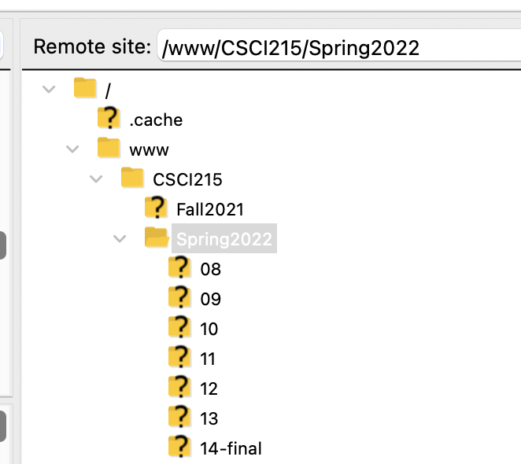
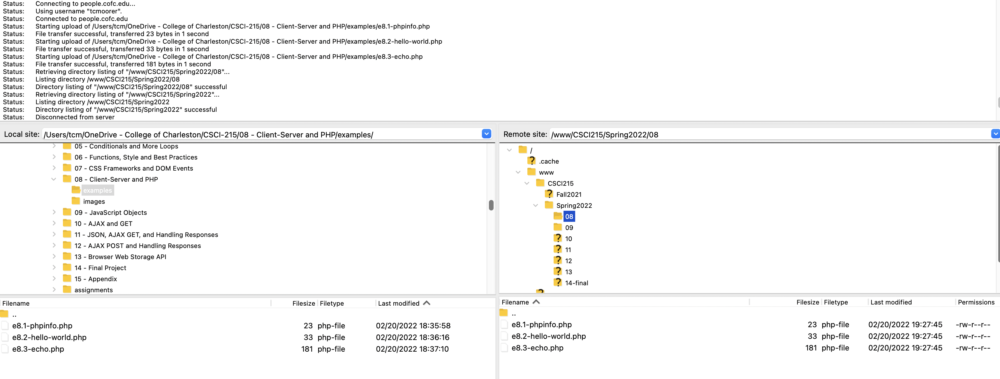
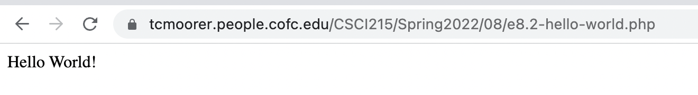

# CofC Account Set Up

We will be using cofc.edu student web accounts for sections using PHP as support is built in. You should have established
a student web account in the prerequisite class CSCI-115 - Website Design.

1. See the following for basic info: <http://stu.cofc.edu/index.php>
2. For instructions on how to use, see: <http://stu.cofc.edu/howto.php>

## Set Up for CSCI215

Once you have confirmed access to your student web account, create the following directories for class files related
PHP and remaining sections in this class. 

```
/
+ www/
    + CSCI215/
        + Spring2022/
            + 08/
            + 09/
            + 10/
            + 11/
            + 12/
            + 13/
            + 14-final/
```

and here's a image from FileZilla



## Upload Examples and Access Files in Browser

Now that the class directories are created, upload the 3 example files under Section 8 - Client-Server and PHP:


> - e8.1-phpinfo.php
> - e8.2-hello-world.php
> - e8.3-echo.php


The following screenshot shows the files copied into the `08` directory.



In order to access the files, one way is to use a browser. 

For my account, for example:

> <https://tcmoorer.people.cofc.edu/CSCI215/Spring2022/08/e8.2-hello-world.php>

Accessing this in the browser will result in



Your student account will have the following pattern:


> <https://[username].stu.cofc.edu/CSCI215/Spring2022/08/e8.1-phpinfo.php>
> <https://[username].stu.cofc.edu/CSCI215/Spring2022/08/e8.2-hello-world.php>
> <https://[username].stu.cofc.edu/CSCI215/Spring2022/08/e8.3-echo.php>
