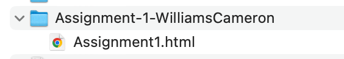

# Turning In Assignments

## Assumption
All coding assignments will be developed on your personal computers. These are primarily web design files (HTML, CSS, and JavaScript). OAKs will not handle these files correctly when uploading these files. Students must follow the following instructions when turning in assignments via OAKs.

## Turning in Assignments
1.	Create a directory for the assignment. Use the naming convention `Assignment-[number]-[YourName]`.
2.	Add any files necessary to complete the assignment to the directory. This will include `.html`, `.css`, and `.js` files.
3.	Use zip (or similar compression program) to convert the directory and contents to a .zip file.
      
## Example
You are working on assignment number one and your name is Cameron Williams. The assignment will require a .html file to complete the assignment.
1.	Create a directory called `Assignment-1-WilliamsCameron`.
2.	Create a file according to the instructions in the assignment (ex. `Assignment.html`) in the directory called `Assignment-1-WilliamsCameron`. Modify the file as needed to complete the assignment.
3.	Compress (zip) the `Assignment-1-WilliamsCameron` directory and upload into OAKs as your assignment solution.

## Example Sample

